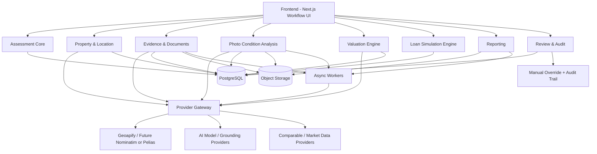

# Architecture Blueprint: House Collateral Assessment App

**Date:** 2026-04-29  
**Status:** Draft  
**Scope:** PoC/demo that can evolve into serious product development with minimal rewrites

## 1. Executive Summary

This blueprint proposes a **future-proof modular monolith** for a house/property collateral assessment application. The goal is to support a fast PoC while preserving the core architectural boundaries needed for later production hardening.

The recommended foundation is:

- **Frontend:** Next.js
- **Backend:** Node.js/Express or equivalent TypeScript service layer
- **Persistence:** PostgreSQL for transactional data
- **Object Storage:** for photos, scanned documents, and generated reports
- **Async Jobs:** background processing for OCR, AI extraction, enrichment, and report generation
- **Map/Geocoding Renderer:** MapLibre on the frontend
- **Geocoding/Autocomplete Provider (initial):** Geoapify behind an internal provider adapter
- **Long-term Migration Path:** self-hosted Nominatim or Pelias without changing the frontend contract

The system must treat AI as an **assistive layer**, not as the authoritative source of truth for property identity, legal facts, or final valuation decisions.

---

## 2. Product Goal

The product helps users or internal officers perform an early-stage collateral assessment for **houses/properties** by combining:

- address and map verification,
- property photo analysis,
- document extraction,
- valuation support,
- loan simulation,
- human review and override.

This is not only an image-scanning app. It is an **assessment workflow system** with evidence, valuation logic, and reviewability.

---

## 3. Architectural Principles

### 3.1 Optimize for low rework

The PoC should not be throwaway. Internal boundaries should be designed now so that later changes mostly affect modules, not the whole system.

### 3.2 Modular monolith first

Use one deployable backend service initially, but organize it into strict modules. This avoids premature microservices while preserving extraction points for future scaling.

### 3.3 Evidence-first design

Every important output should be traceable to:

- user input,
- uploaded evidence,
- provider response,
- model output,
- valuation rule version,
- manual reviewer changes.

### 3.4 Provider abstraction from day one

Do not let internal business logic depend directly on Geoapify, Google Grounding, Gemini, or any specific third-party schema.

### 3.5 AI is assistive, not authoritative

AI can extract, summarize, classify, and draft. It should not be the single source of truth for:

- property identity,
- legal ownership,
- final pricing,
- policy approval.

### 3.6 Human override is a first-class feature

Assessment systems without override and auditability become dead ends in serious environments.

---

## 4. Recommended High-Level Architecture

## 4.0 System Architecture Diagram

## 4.1 Frontend

The frontend should serve as a workflow layer, not a place for core business rules.

Main responsibilities:

- multi-step assessment flow,
- file upload and preview,
- map/address confirmation,
- review/edit AI-extracted results,
- pricing and simulation display,
- report export and reviewer actions.

Recommended UI areas:

1. **Intake / Create Assessment Case**
2. **Location & Property Identity**
3. **Document Upload & Extraction**
4. **Property Photo Assessment**
5. **Valuation & Comparable Review**
6. **Loan Simulation**
7. **Reviewer Decision / Override**
8. **Final Report**

## 4.2 Backend

The backend should be a modular monolith with these internal modules:

1. **Assessment Core**
2. **Property & Location**
3. **Evidence & Documents**
4. **Photo/Condition Analysis**
5. **Valuation Engine**
6. **Loan Simulation Engine**
7. **AI Assist Layer**
8. **Provider Gateway**
9. **Reporting**
10. **Audit & Review**

## 4.3 Infrastructure

Recommended initial infrastructure:

- **PostgreSQL**: source of truth for transactional and structured assessment data
- **Blob/Object Storage**: photos, documents, report outputs
- **Background Worker**: OCR, AI extraction, enrichment, report generation
- **Cache**: provider responses, geocoding results, enrichment snapshots
- **Observability**: logs, request tracing, job monitoring

---

## 5. Domain Modules

## 5.1 Assessment Core

This is the system anchor.

Responsibilities:

- create and manage assessment case lifecycle,
- track workflow state,
- connect all sub-results into one coherent case,
- control status transitions.

Suggested status flow:

- `draft`
- `location_verified`
- `documents_processed`
- `photos_processed`
- `valuation_ready`
- `under_review`
- `approved`
- `rejected`
- `archived`

## 5.2 Property & Location

Responsibilities:

- canonical address storage,
- geocoding and reverse geocoding,
- coordinate verification,
- location confidence,
- optional parcel/cadastral identity,
- neighborhood and zoning enrichment.

This module should own the distinction between:

- user-entered address,
- normalized address,
- geocoded coordinates,
- reviewer-confirmed location.

## 5.3 Evidence & Documents

Responsibilities:

- document upload metadata,
- OCR extraction,
- legal document parsing,
- extracted field review,
- evidence versioning.

Likely document types:

- Sertifikat/SHM/SHGB
- PBB
- AJB
- IMB/PBG if available
- utility/supporting proof
- internal appraisal attachments

## 5.4 Photo / Condition Analysis

Responsibilities:

- accept multiple house photos,
- classify room/exterior view,
- identify visible issues,
- generate draft condition findings,
- attach confidence and source photos.

Typical condition dimensions:

- facade quality,
- roof condition,
- wall cracks,
- water damage,
- mold/humidity,
- floor/finishing quality,
- surrounding access quality.

## 5.5 Valuation Engine

Responsibilities:

- combine structured facts into estimated collateral value,
- separate land and building considerations,
- apply adjustments,
- attach comparable evidence,
- expose rule version and assumptions.

Important rule inputs:

- location,
- land area,
- building area,
- building age,
- condition score,
- access road,
- flood/zone risk,
- comparable market evidence,
- legal certainty.

## 5.6 Loan Simulation Engine

Responsibilities:

- simulate loan options from valuation output,
- apply LTV policy,
- show installment or product simulation,
- expose policy parameters as versioned rules.

## 5.7 AI Assist Layer

Responsibilities:

- OCR post-processing,
- summarization,
- discrepancy detection,
- draft narratives,
- evidence-based explanation.

This module must never directly define the final approved value.

## 5.8 Provider Gateway

Responsibilities:

- isolate all external provider integration,
- normalize provider outputs,
- preserve raw provider payload,
- support provider swaps later.

External provider categories:

- geocoding/autocomplete,
- map tiles,
- AI models,
- grounding/search enrichment,
- property market/comparable data,
- OCR/document extraction.

## 5.9 Reporting

Responsibilities:

- create assessment report,
- export PDF,
- render evidence-backed summary,
- include assumptions and reviewer notes.

## 5.10 Audit & Review

Responsibilities:

- reviewer decision trail,
- before/after override recording,
- reason capture,
- timeline of actions,
- evidence traceability.

---

## 6. Data Model Blueprint

The exact schema can evolve, but the conceptual entities should be stable.

## 6.1 Core entities

### AssessmentCase

- id
- reference_number
- status
- applicant_id (optional depending on scope)
- created_at
- updated_at
- created_by
- assigned_reviewer
- assessment_type

### Property

- id
- assessment_case_id
- property_type
- occupancy_type
- land_area_sqm
- building_area_sqm
- floors
- bedrooms
- bathrooms
- estimated_build_year
- renovation_notes
- legal_status_summary

### AddressLocation

- id
- property_id
- raw_address_text
- normalized_address_text
- province
- city_regency
- district
- subdistrict
- postal_code
- latitude
- longitude
- geocode_precision
- geocode_confidence
- parcel_identifier (nullable)
- geocode_provider
- geocode_snapshot_id
- manually_confirmed

### EvidenceItem

- id
- assessment_case_id
- type (`photo`, `document`, `provider_snapshot`, `report`, `note`)
- storage_url
- mime_type
- source
- uploaded_by
- created_at

### DocumentExtraction

- id
- evidence_item_id
- document_type
- extracted_fields_json
- confidence_json
- extraction_provider
- extraction_version
- reviewed_json
- reviewer_status

### PropertyConditionAssessment

- id
- property_id
- summary
- findings_json
- condition_score
- severity_breakdown
- model_provider
- model_version
- reviewer_override_json

### ComparableSet

- id
- property_id
- source_type
- comparable_items_json
- generated_at
- provider
- reviewer_adjustments_json

### ValuationRun

- id
- assessment_case_id
- rule_version
- inputs_snapshot_json
- output_json
- confidence
- generated_at
- approved_override_json

### LoanSimulationRun

- id
- assessment_case_id
- valuation_run_id
- product_mode
- rules_version
- inputs_snapshot_json
- output_json

### ReviewOverride

- id
- assessment_case_id
- target_type
- target_id
- before_json
- after_json
- reason
- reviewer_id
- created_at

### AuditEvent

- id
- assessment_case_id
- actor_type
- actor_id
- action
- payload_json
- created_at

---

## 7. Address, Map, and Geocoding Strategy

## 7.1 Recommended default strategy

For the initial PoC that should scale later:

- **Map renderer:** MapLibre
- **Geocoding/autocomplete provider:** Geoapify
- **Internal abstraction:** `LocationProvider` interface inside backend

Why this combination:

- MapLibre keeps the UI vendor-neutral.
- Geoapify provides practical hosted geocoding/autocomplete without forcing a full rewrite later.
- The provider abstraction allows migration to self-hosted Nominatim or Pelias later.

## 7.2 Rules for location handling

1. Never use free-text address as the sole property identifier.
2. Always store both raw and normalized address.
3. Always store lat/lng and confidence.
4. Allow manual pin correction on the map.
5. Distinguish between:
   - user-entered location,
   - provider-geocoded location,
   - reviewer-confirmed location.
6. Cache geocoding results.
7. Preserve raw provider responses for auditability.

## 7.3 Long-term migration path

When usage or control needs grow:

- switch backend geocoding adapter from Geoapify to **self-hosted Nominatim** if simplicity/control matters,
- or to **Pelias** if advanced autocomplete/extensibility matters more.

The frontend should not need major changes if the backend contract is stable.

---

## 8. AI Boundaries

## 8.1 Good uses of AI

AI is appropriate for:

- OCR post-processing,
- extracting structured fields from uploaded documents,
- summarizing document contents,
- identifying visible property issues from photos,
- generating draft assessment narratives,
- finding possible comparable-market hints,
- highlighting inconsistencies across documents and images.

## 8.2 Bad uses of AI

AI should **not** be the single source of truth for:

- authoritative address/coordinates,
- legal ownership,
- zoning/legal certainty,
- final collateral value,
- approval decision.

## 8.3 Safe use of grounding in PoC

If internal property data is not ready yet, grounding may be used temporarily for:

- area summaries,
- indicative comparable narrative,
- contextual notes around neighborhood pricing.

But grounded outputs must be treated as:

- **supporting evidence**, not final truth,
- editable by reviewer,
- traceable to source snapshot,
- clearly separated from deterministic rule-based outputs.

## 8.4 BTN Block Form OCR Blueprint

For the **branch / bank-assisted KPR channel**, the system should assume that some BTN forms are not free-form documents. They are **structured block forms** where:

- one box contains one character,
- one cluster of boxes forms one field,
- some fields use checkboxes instead of text,
- field coordinates are stable because the form layout is standardized.

This means the extraction strategy must be different from normal OCR used for KTP, KK, salary slips, or scanned letters.

### Core principle

Treat BTN block forms as **template-driven structured documents**, not generic images.

The system should know:

- what form type is being uploaded,
- where each field lives,
- whether the field is text, numeric, date, or checkbox,
- how many boxes belong to the field,
- what validation rules apply after extraction.

### Why generic OCR is not enough

Generic OCR or pure vision-model extraction tends to fail in predictable ways for block forms:

- character order is unstable,
- adjacent boxes get merged,
- blank boxes are hallucinated,
- checkboxes are misread as text,
- field boundaries are lost,
- confidence is hard to localize per field.

Therefore, the primary engine for BTN block forms should be **template alignment + per-field extraction + deterministic validation**. AI may still be used as a fallback or repair layer, but not as the primary reader.

### Recommended logical flow

1. **Upload / scan intake**
   - receive scanned form image or PDF
   - preserve the raw file as evidence
2. **Document classification**
   - identify the exact form version/template
   - reject or route to manual review if the template is unknown
3. **Image preprocessing**
   - deskew
   - denoise
   - threshold/contrast normalize
   - perspective correction
   - page boundary detection
4. **Template alignment**
   - match scan to known form anchor points
   - transform image into normalized template coordinates
5. **Field region extraction**
   - crop each field region based on template registry
   - split character-box fields into box-level subregions
   - detect checkbox state for checkbox fields
6. **Per-box / per-field recognition**
   - OCR one box at a time for text/numeric fields
   - aggregate box sequence into one field value
   - detect checked/unchecked state for checkboxes
7. **Post-processing and validation**
   - normalize formatting
   - validate by field rule
   - assign confidence per field
8. **Review UI**
   - show extracted values field-by-field
   - highlight low-confidence values
   - allow manual correction
   - preserve before/after audit trail
9. **Persist structured result**
   - save raw scan, extraction result, corrected value, confidence, and template version

### Recommended OCR architecture modules

#### A. Form Template Registry

Stores all known form definitions.

Each template should describe:

- template id and version,
- form name,
- page count,
- field list,
- anchor/reference points,
- field bounding boxes,
- field type,
- number of character boxes,
- checkbox rules,
- validation rules,
- optional fallback parsing hints.

This registry is the heart of the structured OCR flow.

#### B. Image Preprocessing Service

Responsibilities:

- image cleanup,
- orientation correction,
- perspective normalization,
- border/page detection,
- quality scoring.

This service should expose a quality flag so poor scans can be routed for retry or manual review.

#### C. Template Alignment Engine

Responsibilities:

- identify the closest matching template,
- align input image into normalized coordinates,
- ensure field crops are taken from consistent locations.

Without alignment, even a good OCR engine will drift when forms are scanned at slight angles.

#### D. Structured Field Extraction Engine

Responsibilities:

- extract characters box-by-box,
- detect checkbox state,
- reconstruct grouped fields,
- emit per-field confidence.

This engine should support at least these field types:

- `single_char_boxes`
- `numeric_boxes`
- `date_boxes`
- `checkbox_single`
- `checkbox_group`
- `signature_present`

#### E. Validation & Normalization Engine

Responsibilities:

- combine character boxes into a final field value,
- normalize text casing/spacing,
- validate field formats,
- classify extraction risk.

Typical validations:

- NIK must be 16 digits
- date fields must be valid dates
- phone numbers must match expected patterns
- mandatory checkbox groups must have one selected value
- mandatory fields cannot be blank

#### F. Review & Override UI Layer

Responsibilities:

- show the original scan beside extracted values,
- highlight field bounding boxes,
- allow reviewer click-to-edit,
- track changed values,
- force reason entry for sensitive field overrides if needed.

#### G. Evidence & Audit Storage

Must store:

- raw uploaded scan,
- preprocessed scan version,
- template id/version used,
- extracted field JSON,
- confidence JSON,
- corrected/reviewed JSON,
- audit trail of changes.

### Suggested data model additions for block forms

Add these conceptual entities when branch-form OCR becomes in scope:

#### FormTemplate

- id
- template_code
- template_version
- form_name
- page_count
- anchor_definition_json
- fields_definition_json
- is_active

#### FormSubmission

- id
- assessment_case_id
- form_template_id
- evidence_item_id
- preprocessing_status
- alignment_status
- extraction_status
- extraction_provider
- extracted_at

#### FormFieldResult

- id
- form_submission_id
- field_key
- field_type
- raw_value
- normalized_value
- confidence
- bbox_json
- review_status
- reviewed_value

### Failure handling strategy

Block form OCR should not pretend every scan is machine-readable.

Explicit failure states should include:

- `unknown_template`
- `poor_scan_quality`
- `alignment_failed`
- `field_confidence_low`
- `validation_failed`
- `manual_review_required`

These states are important because structured OCR systems become unreliable when they silently guess.

### Product flow recommendation for the two KPR channels

If the product really has two submission channels, the architecture should split document intake like this:

1. **Branch / bank-assisted channel**
   - structured BTN block form OCR pipeline
   - supports physical/scanned forms
   - optimized for template-based extraction
2. **Bale / digital channel**
   - standard document OCR/extraction pipeline
   - optimized for KTP, KK, slip gaji, and supporting digital uploads

The important design rule is: **same Assessment Case domain, different extraction pipelines**.

That lets the business keep one unified KPR assessment system while using the right OCR approach per intake channel.

### Implementation recommendation

When coding starts, do not build block-form OCR as a generic AI prompt flow.

Start with:

1. template registry,
2. alignment logic,
3. box-level extraction,
4. field validation,
5. manual review UI,
6. audit-safe persistence.

AI can be added later as:

- fallback repair for low-confidence fields,
- assistant summary for reviewers,
- discrepancy detector across structured form and supporting documents.

That ordering will produce a more stable and enterprise-usable branch OCR foundation.

---

## 9. Conceptual API Blueprint

These are conceptual API groups, not final endpoint designs.

## 9.1 Assessment Case APIs

- create assessment case
- get assessment case detail
- update case metadata
- move case status
- assign reviewer

## 9.2 Location APIs

- address autocomplete
- geocode address
- reverse geocode coordinates
- save confirmed property location
- get location confidence and provider metadata

## 9.3 Evidence APIs

- upload document
- upload property photos
- list evidence for case
- fetch evidence metadata

## 9.4 Extraction & Analysis APIs

- process uploaded documents
- process property photos
- get extracted document fields
- get photo condition findings
- submit reviewer edits to extracted results

## 9.5 Valuation APIs

- run valuation
- get valuation detail
- update valuation assumptions
- attach/remove comparables
- rerun valuation

## 9.6 Simulation APIs

- run loan simulation
- compare product simulations
- save selected simulation

## 9.7 Review APIs

- approve case
- reject case
- submit manual override
- fetch audit trail

## 9.8 Reporting APIs

- generate assessment report
- download report
- fetch narrative summary

---

## 10. Workflow Blueprint

## 10.1 Primary assessment flow

1. Officer/user creates a new assessment case.
2. User enters address or drops a pin.
3. System geocodes and normalizes location.
4. User uploads house documents.
5. System extracts structured document data.
6. User uploads house photos.
7. System analyzes visible property condition.
8. User/reviewer edits extracted facts if needed.
9. System runs valuation.
10. System runs loan simulation.
11. Reviewer checks evidence, comparables, and outputs.
12. Reviewer approves or overrides.
13. System generates final report.

## 10.2 Review-friendly workflow requirements

At every stage the system should support:

- save draft,
- edit extracted results,
- resubmit for recalculation,
- compare previous vs current result,
- capture reviewer reasons.

---

## 11. Phased Delivery Roadmap

## Phase 1 — PoC / Demo

Objective: demonstrate end-to-end viability.

Scope:

- single-region or limited-region support,
- one geocoding provider,
- core document upload,
- photo upload,
- AI-assisted extraction,
- simple valuation logic,
- simple simulation,
- basic PDF report.

Non-goals:

- complex user roles,
- full-scale audit dashboard,
- advanced parcel integration,
- multi-region policy complexity.

## Phase 2 — Pilot

Objective: make the system operationally credible.

Add:

- RBAC,
- improved cache,
- queue workers,
- stronger audit timeline,
- review dashboard,
- valuation rule versioning,
- provider monitoring.

## Phase 3 — Serious Development

Objective: production-grade scale and maintainability.

Possible extractions:

- document/AI processing workers,
- provider ingestion service,
- report generation service.

Keep stable:

- Assessment Core,
- Property/Location model,
- Valuation domain model,
- Review/Audit model.

---

## 12. Risks and Mitigations

## 12.1 Provider lock-in

**Risk:** frontend and business logic become dependent on one vendor schema.  
**Mitigation:** provider adapter + raw snapshot + normalized internal DTO.

## 12.2 Address ambiguity

**Risk:** the same property appears in multiple formats or low-confidence geocodes.  
**Mitigation:** canonical address model, coordinate confirmation, confidence score, manual review.

## 12.3 Non-reproducible AI outputs

**Risk:** a later rerun gives different results with no auditability.  
**Mitigation:** store model version, prompt version, input snapshot, and extracted result version.

## 12.4 Weak valuation trust

**Risk:** users do not trust estimated value.  
**Mitigation:** expose assumptions, comparables, evidence, and reviewer override trail.

## 12.5 POC shortcuts leaking into core design

**Risk:** demo-only logic becomes hardwired.  
**Mitigation:** isolate shortcuts in provider adapters and feature flags, not in domain model.

---

## 13. Suggested Build Order

This is the recommended implementation sequence once coding starts.

### Step 1 — Assessment Core + Data Model

Build the case lifecycle, entity backbone, and audit trail first.

### Step 2 — Property & Location

Implement address entry, map pin, geocoding, reverse geocoding, and location confirmation.

### Step 3 — Evidence Upload

Implement file upload, evidence metadata, and object storage references.

### Step 4 — Document Extraction

Add OCR/AI-assisted extraction and editable results.

### Step 5 — Property Photo Analysis

Add house photo analysis and editable condition findings.

### Step 6 — Valuation Engine

Build deterministic valuation logic with assumptions and confidence.

### Step 7 — Simulation Engine

Add loan simulation based on valuation output.

### Step 8 — Review & Override

Add reviewer actions, override logging, and before/after comparisons.

### Step 9 — Reporting

Generate a clean assessment summary and final report.

---

## 14. Final Recommendation

If the objective is to ship a PoC quickly **without boxing the team into a dead-end architecture**, the best path is:

- keep the solution as a **modular monolith**,
- model around an **Assessment Case**,
- preserve **evidence and provenance**,
- isolate all third-party dependencies in a **Provider Gateway**,
- use **MapLibre + Geoapify** initially,
- prepare a clean migration path to **self-hosted Nominatim or Pelias** later,
- keep AI strictly in an **assistive role**,
- and make **manual override + auditability** part of the core product, not an afterthought.

That combination gives the fastest PoC today and the lowest rewrite risk tomorrow.
